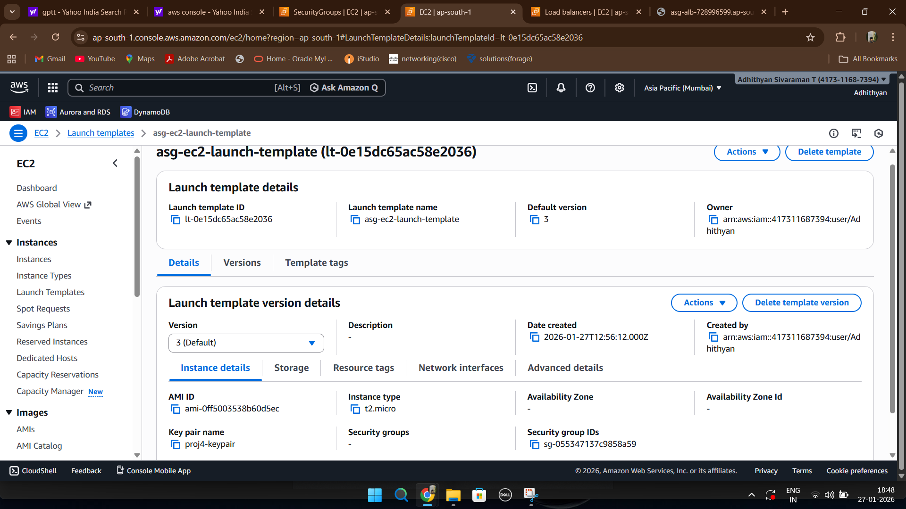
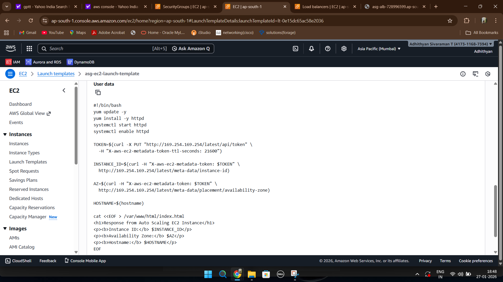
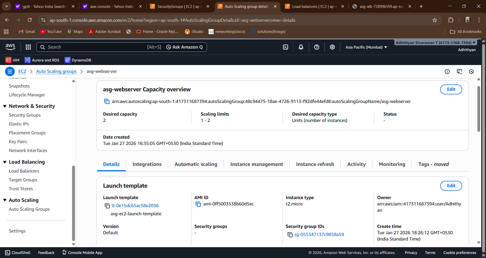
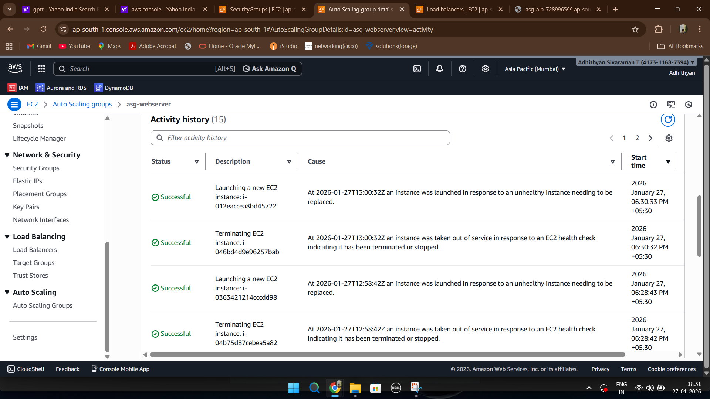
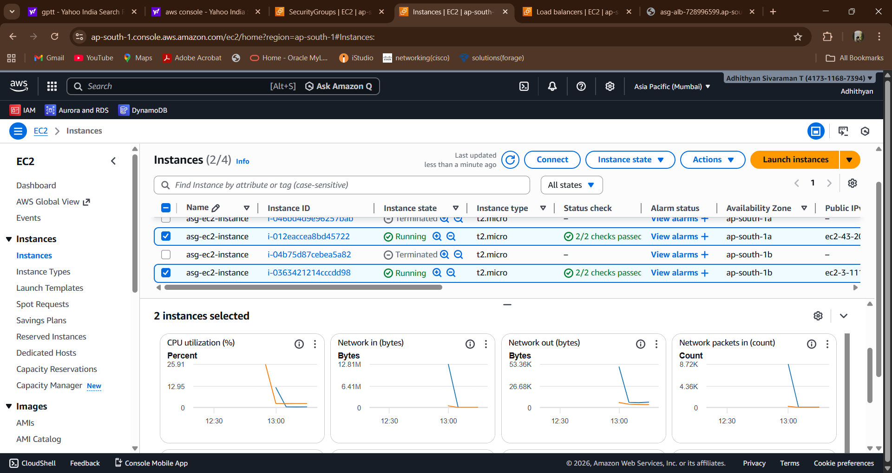
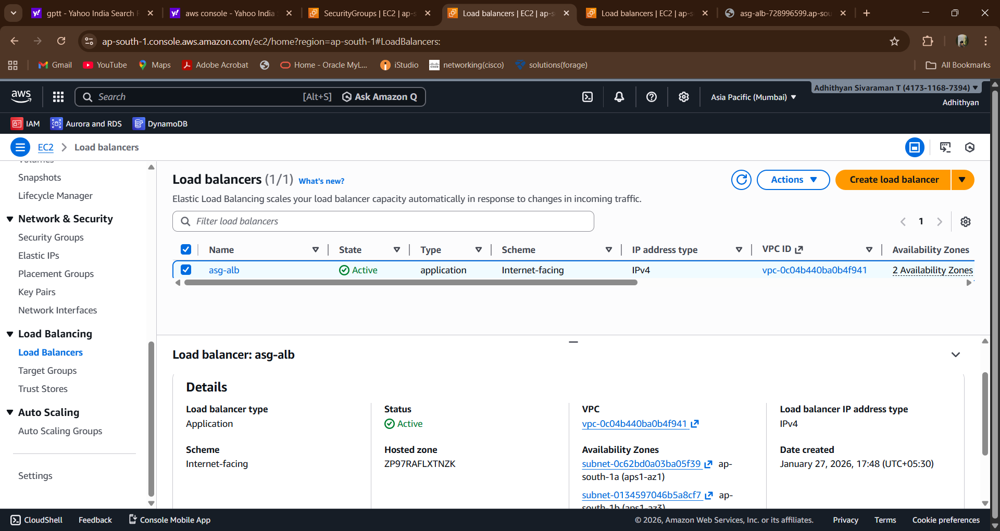
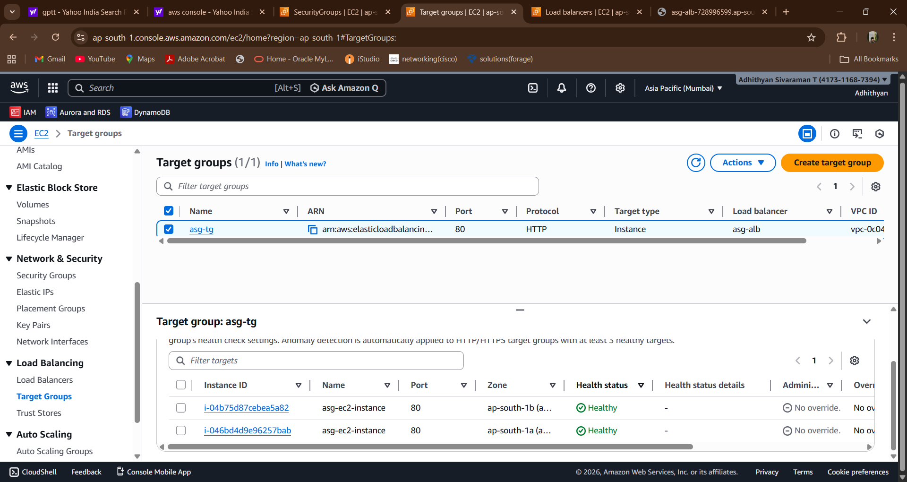
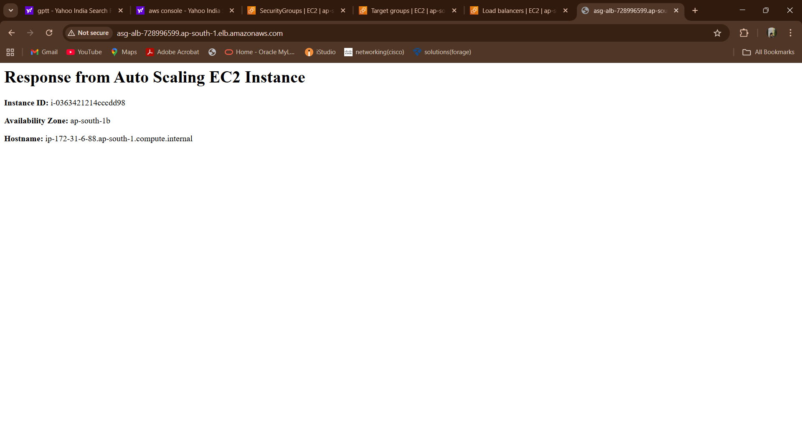

# 🚀 Auto Scaling Web Architecture using EC2 and Application Load Balancer

This project demonstrates how to design and implement a **scalable and highly available cloud architecture on AWS** using **EC2 Auto Scaling Group and Application Load Balancer (ALB)**.

The architecture automatically adjusts the number of EC2 instances based on demand and distributes incoming traffic across multiple instances to maintain application availability and performance.

---

# 📌 Project Overview

Modern cloud applications often experience **unpredictable traffic patterns**.  
Manually managing infrastructure during traffic spikes can lead to downtime and inefficient resource usage.

AWS provides **Auto Scaling and Load Balancing services** that allow infrastructure to automatically adapt to changing workloads.

This project implements a scalable web architecture where:

- EC2 instances are automatically launched and terminated
- Traffic is distributed across instances using an Application Load Balancer
- The application remains available even if an instance fails
- Infrastructure scales automatically based on demand

---

# 🏗️ Architecture Diagram

The following architecture diagram illustrates how traffic flows through AWS services to reach EC2 instances.

.png)

### Architecture Flow

1️⃣ Users send requests through the internet  
2️⃣ Requests reach the **Application Load Balancer (ALB)**  
3️⃣ ALB routes traffic to the **Target Group**  
4️⃣ Target Group forwards requests to healthy **EC2 instances**  
5️⃣ EC2 instances serve the application using the **Apache Web Server**  
6️⃣ **Auto Scaling Group** manages the number of EC2 instances automatically

---

# ☁️ AWS Services Used

### 🖥 Amazon EC2
Provides the compute instances that host the web application.

### 📄 Launch Template
Defines the configuration used to automatically launch EC2 instances.

### ⚙️ Auto Scaling Group
Automatically manages EC2 instance scaling to maintain desired capacity.

### 🌐 Application Load Balancer
Distributes incoming traffic across multiple EC2 instances.

### 🎯 Target Group
Registers EC2 instances and performs health checks.

### 🧩 Apache Web Server
Hosts the web application running on EC2 instances.

---

# 🔁 Project Architecture Workflow

The architecture operates using the following workflow:

1. A user sends a request through the internet.
2. The request is received by the **Application Load Balancer**.
3. The Load Balancer forwards the request to the **Target Group**.
4. The Target Group routes traffic to healthy EC2 instances.
5. EC2 instances serve the request using the Apache web server.
6. The **Auto Scaling Group** monitors instance health and capacity.
7. If needed, new EC2 instances are automatically launched.

---

# ⚙️ Automation Using User Data Script

Each EC2 instance is automatically configured during launch using a **User Data script** included in the Launch Template.

The script performs the following tasks:

- Updates system packages
- Installs Apache web server
- Starts and enables Apache service
- Retrieves EC2 instance metadata
- Generates a dynamic webpage displaying instance information

📄 Script location:

scripts/userdata.sh

---

# 📸 Project Implementation Screenshots

Below are the key configuration steps performed during the implementation.

---

## Launch Template Configuration

Defines the configuration used for launching EC2 instances automatically.

---

## User Data Script

Script used to automatically install and configure the Apache web server.

---

## Auto Scaling Group Configuration

Defines the minimum, maximum, and desired number of EC2 instances.

---

## Auto Scaling Activity

Shows scaling activity where instances are automatically replaced or launched.

---

## EC2 Instances Managed by ASG

Displays running EC2 instances managed by the Auto Scaling Group.

---

## Application Load Balancer

The Application Load Balancer distributing traffic across EC2 instances.

---

## Target Group Health Check

Shows EC2 instances registered in the Target Group and their health status.

---

## Load Balancer Response

Refreshing the page routes traffic to different EC2 instances, demonstrating load balancing.

---

# 🎥 Project Demo Videos

Two demonstration videos are provided for this project.

### 1️⃣ Auto Scaling Group Scaling Demo

This demo shows how the **Auto Scaling Group dynamically launches and terminates EC2 instances when the desired capacity is modified**.

### 2️⃣ Load Balancer Traffic Distribution Demo

This demo demonstrates how the **Application Load Balancer distributes requests across multiple EC2 instances when the page is refreshed**.

📹 Demo video links available here:

demo/README.md

---

# 🎯 Key Learnings

Through this project, the following cloud architecture concepts were implemented:

- EC2 Launch Templates
- Auto Scaling Groups
- Application Load Balancer configuration
- Target Group health checks
- Infrastructure automation using User Data scripts
- Load balancing across multiple instances
- High availability architecture

---

# ✅ Project Outcome

The architecture successfully achieves:

✔ Automatic scaling of EC2 instances  
✔ Load-balanced traffic distribution  
✔ High availability deployment  
✔ Fault tolerant infrastructure  
✔ Scalable cloud architecture  

This project demonstrates a **production-style compute architecture built using AWS services**.

---

# 📂 Repository Structure

04-ec2-auto-scaling-alb-architecture
│
├── architecture  
├── documentation  
├── screenshots  
├── scripts  
├── demo  
│
└── README.md  

---

# 🔮 Future Improvements

Possible improvements to this architecture include:

- Implement scaling policies using CloudWatch metrics
- Configure HTTPS using AWS Certificate Manager (ACM)
- Deploy EC2 instances in private subnets
- Integrate centralized logging and monitoring

---

# 👨‍💻 Author

**Adhithyan Sivaraman T**  
Aspiring Certified Cloud & DevOps Engineer

🔗 GitHub  
https://github.com/Adhithyan-10

🔗 LinkedIn  
https://www.linkedin.com/in/adhithyan-sivaraman-t-399b5b362
